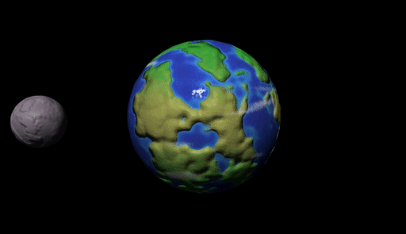

# Shader Pipeline

## Tasks

There are no [header files](https://stackoverflow.com/a/19709740/148668).
Accordingly, this assignment is organized a bit differently. The `src/`
directory contains glsl files whose contents should be completed or replaced.
Some of the functions have an element of creative freedom (e.g.,
`src/bump_position.glsl`), while others are have a well-defined specification
(e.g., `src/identity.glsl`).

Since glsl does not support `#include`, the comments may hint that a previously
defined function can/should/must be used by writing `// expects: ...`.

You may check the corresponding `.json` example file to see specifically which
glsl files are loaded (and in which order) for each test program.

Unless otherwise noted, _**do not declare new functions**_. 

### White list

  - [`mix`](https://www.khronos.org/registry/OpenGL-Refpages/gl4/html/mix.xhtml)
  - [`normalize`](https://www.khronos.org/registry/OpenGL-Refpages/gl4/html/normalize.xhtml)
  - [`length`](https://www.khronos.org/registry/OpenGL-Refpages/gl4/html/length.xhtml)
  - [`clamp`](https://www.khronos.org/registry/OpenGL-Refpages/gl4/html/clamp.xhtml)
  - [`sin`](https://www.khronos.org/registry/OpenGL-Refpages/gl4/html/sin.xhtml)
  - [`cos`](https://www.khronos.org/registry/OpenGL-Refpages/gl4/html/cos.xhtml)
  - [`abs`](https://www.khronos.org/registry/OpenGL-Refpages/gl4/html/abs.xhtml)
  - [`pow`](https://www.khronos.org/registry/OpenGL-Refpages/gl4/html/pow.xhtml)

### Black list
 
  - `noise1`
  - `noise2`
  - `noise3`
  - `noise4`

This assignment works best if you implement the following tasks _in order_.

Before editing anything be sure that your opengl and shader setup is correct. If you run `./shaderpipeline ../data/test-01.json` you should see this
image: 

### `src/identity.glsl`

### `src/uniform_scale.glsl`

### `src/translate.glsl`

### `src/rotate_about_y.glsl`

### `src/model.glsl`

### `src/model_view_projection.vs`

### `src/blue_and_gray.fs`

With these implemented you should now be able to run `./shaderpipeline
../data/test-02.json` and see an animation of a gray moon orbiting around a blue
planet: 

If you press `L` this should switch to a [wireframe]() rendering:

### `src/5.tcs`

Running `./shaderpipeline ../data/test-03.json` and pressing `L` should produce an
animation of a gray moon orbiting around a blue planet in wireframe with more
triangles: 

### `snap_to_sphere.tes`

Move your model-view-projection operations from the vertex shader (e.g.,
`model_view_projection.vs`) to the tessellation evaluation shader. In addition,
snap the vertices of each shape to the unit sphere before applying these
transformations. This gives your shapes a round appearance if you run
`./shaderpipeline ../data/test-04.json`: 

### `blinn_phong.glsl`

### `lit.fs`

Running `./shaderpipeline ../data/test-05.json` adds light to the scene and we
see a smooth appearance with specular highlights: 

### `random_direction.glsl`

### `smooth_step.glsl`

### `perlin_noise.glsl`

### `procedural_color.glsl`

Be creative! Your procedural colored shape does not need to look like marble
specifically and does not need to match the example. Mix and match different
noise frequencies and use [function
composition](https://en.wikipedia.org/wiki/Function_composition) to create an
interesting, complex pattern.

Running `./shaderpipeline ../data/test-06.json` adds a procedural _color_ to the
objects. The color should _**not**_ change based on the view or model
transformation. For example, this animation attempts to recreate a
[marble](https://en.wikipedia.org/wiki/Marble) texture: 

### `improved_smooth_step.glsl`

### `improved_perlin_noise.glsl`

### `bump_height.glsl`

### `bump_position.glsl`

### `tangent.glsl`

### `bump.fs`

Be creative! Your bumpy shape does not need to match the example.

Running `./shaderpipeline ../data/test-07.json` adds a [normal
map](https://en.wikipedia.org/wiki/Normal_mapping) determined by differentiating
a procedural [bump map](https://en.wikipedia.org/wiki/Bump_mapping). The color
should _**not**_ change based on the view or model transformation. For example,
this animation attempts to recreate the (very) bumpy appearance of planets and
moons: 

For this file, you _**may**_ declare new functions: declare them directly at the
top of `bump.fs`; do not modify the .json files.

### `planet.fs`

For this file, you _**may**_ declare new functions: declare them directly at the
top of `planet.fs`; do not modify the .json files.

Be creative! Your planets do not need to look like the earth/moon and do not
need to look like the example planets.

> **Hint:** Sprinkle noise on _everything_: diffuse color, specular color,
> normals, specular exponents, color over time.

Running `./shaderpipeline ../data/test-08.json` should display a creative planet
scene. For example: 

