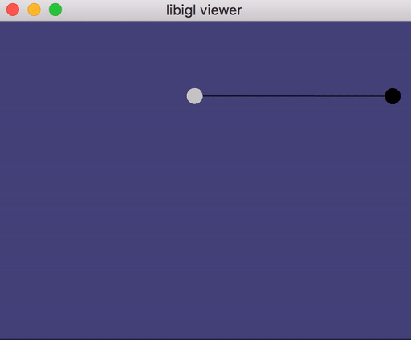
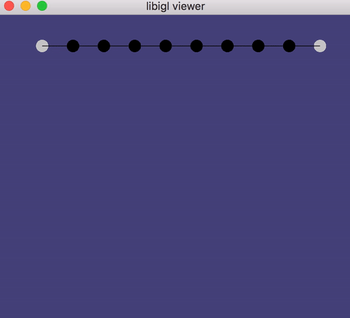
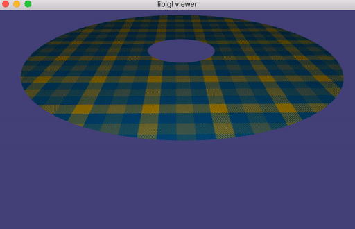

# Mass-Spring Systems

## Tasks

### White List

- `Eigen::Triplet`

### Black List

- `igl::edge_lengths`
- `igl::diag`
- `igl::sparse`
- `igl::massmatrix`
- `.sparseView()` on `Eigen::MatrixXd` types

Write your dense code first. This will be simpler to debug.

### `src/signed_incidence_matrix_dense.cpp`

### `src/fast_mass_springs_precomputation_dense.cpp`

### `src/fast_mass_springs_step_dense.cpp`

At this point you should be able to run on small examples.

For example, running `./masssprings_dense ../data/single-spring-horizontal.json`
should produce a swinging, bouncing spring:

If the single spring example is not working, debug immediately before proceeding
to examples with more than one spring.

Running `./masssprings_dense ../data/horizontal-chain.json`
will produce a hanging [catenary chain](https://en.wikipedia.org/wiki/Catenary):

Running `./masssprings_dense ../data/net.json`
will produce a hanging [catenary chain](https://en.wikipedia.org/wiki/Catenary):

If you try to run `./masssprings_dense ../data/flag.json` you'll end up waiting
a while. 

Start your sparse implementations by copying-and-pasting your correct dense
code. Remove any dense operations and construct all matrices using triplet lists.

### `src/signed_incidence_matrix_sparse.cpp`

### `src/fast_mass_springs_precomputation_sparse.cpp`

### `src/fast_mass_springs_step_sparse.cpp`

Now you should be able to see more complex examples, such as running
`./masssprings_sparse ../data/flag.json` or `./masssprings_sparse ../data/skirt.json`:

> ## Notes for TAs editing the README
>
> This README file is too complex for [texify](https://github.com/apps/texify) to render. Use [readme2tex](https://github.com/leegao/readme2tex) locally to render the TeX to SVGs.
>
> `python -m readme2tex --output README.md README.tex.md --nocdn`
> 
> `sed -i 's/invert_in_darkmode\"/invert_in_darkmode\&sanitize=true\"/g' README.md`

